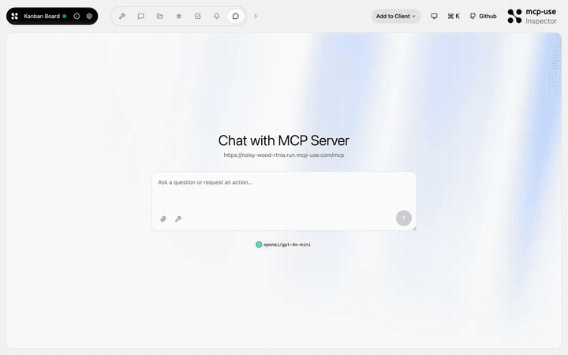
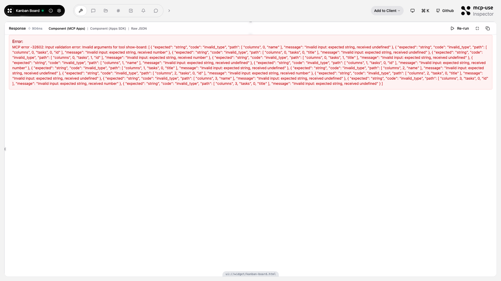

# Kanban Board — Trello in your chat

<p>
  <a href="https://github.com/mcp-use/mcp-use">Built with <b>mcp-use</b></a>
  &nbsp;
  <a href="https://github.com/mcp-use/mcp-use">
    
  </a>
</p>

Interactive task management MCP App. The model creates kanban boards with drag-and-drop columns, adds tasks, moves them between columns, and shows a live board widget in the conversation.



## Try it now

Connect to the hosted instance:

```
https://noisy-wood-rtnia.run.mcp-use.com/mcp
```

Or open the [Inspector](https://inspector.manufact.com/inspector?autoConnect=https%3A%2F%2Fnoisy-wood-rtnia.run.mcp-use.com%2Fmcp) to test it interactively.

### Setup on ChatGPT

1. Open **Settings** > **Apps and Connectors** > **Advanced Settings** and enable **Developer Mode**
2. Go to **Connectors** > **Create**, name it "Kanban Board", paste the URL above
3. In a new chat, click **+** > **More** and select the Kanban Board connector

### Setup on Claude

1. Open **Settings** > **Connectors** > **Add custom connector**
2. Paste the URL above and save
3. The Kanban Board tools will be available in new conversations

## Features

- **Streaming columns** — board builds progressively as tasks are added
- **Task priorities** — low, medium, high with color coding
- **Move tasks** — drag between columns or use the `move-task` tool
- **Assignees** — assign tasks to team members
- **Board summary** — get a quick overview of all tasks

## Tools

| Tool | Description |
|------|-------------|
| `show-board` | Display the kanban board with columns and tasks |
| `add-task` | Add a task to a specific column |
| `move-task` | Move a task between columns |
| `summarize-board` | Get a text summary of the board state |

## Available Widgets

| Widget | Preview |
|--------|---------|
| `kanban-board` |  |

## Local development

```bash
git clone https://github.com/mcp-use/mcp-kanban-board.git
cd mcp-kanban-board
npm install
npm run dev
```

## Deploy

```bash
npx mcp-use deploy
```

## Built with

- [mcp-use](https://github.com/mcp-use/mcp-use) — MCP server framework

## License

MIT
